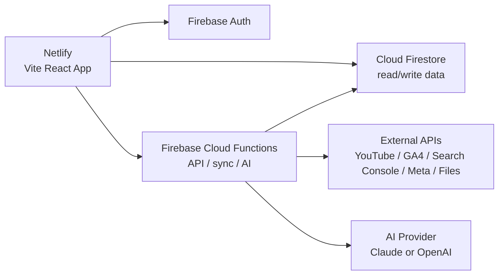

# DummDumm Brand OS Firebase/Netlify 데이터/API 설계서

작성일: 2026-07-29  
결정 사항: Firebase를 백엔드로 사용하고, 웹 프론트는 Netlify로 배포한다.

## 1. 최종 아키텍처



역할 분리:

| 영역 | 선택 | 역할 |
|---|---|---|
| Frontend hosting | Netlify | Vite 앱 빌드/배포, SPA routing |
| Auth | Firebase Auth | 마케팅팀 로그인/조직 권한 |
| Database | Cloud Firestore | 콘텐츠, 게시물, 캠페인, 광고, 지표, AI 보고서 저장 |
| Backend API | Firebase Cloud Functions | OAuth, API sync, AI briefing, 서버 전용 쓰기 |
| File storage | Firebase Storage 또는 Cloud Storage | 업로드 원본 파일 저장 |

중요: Netlify에는 비밀키를 두지 않는다. YouTube/Meta/AI secret은 Firebase Functions 환경변수에 둔다.

## 2. 현재 목업과 연결 방식

현재 프론트는 `VITE_DATA_MODE=api`일 때 HTTP API를 호출한다. Firebase로 가도 이 구조를 유지한다.

```text
Netlify frontend
  -> VITE_API_BASE_URL 또는 VITE_FIREBASE_FUNCTIONS_BASE_URL
  -> Firebase HTTPS Function API
  -> Firestore
```

현재 local mock:

```bash
npm run api
$env:VITE_DATA_MODE="api"
$env:VITE_API_BASE_URL="http://127.0.0.1:8787"
npm run dev -- --port 5174
```

Firebase production:

```text
VITE_DATA_MODE=api
VITE_API_BASE_URL=https://asia-northeast3-YOUR_PROJECT_ID.cloudfunctions.net/api
```

또는:

```text
VITE_FIREBASE_FUNCTIONS_BASE_URL=https://asia-northeast3-YOUR_PROJECT_ID.cloudfunctions.net/api
```

## 3. Firestore 컬렉션 구조

Firestore는 문서/컬렉션 기반이므로 조직별 하위 컬렉션으로 둔다.

```text
orgs/{orgId}
  members/{uid}
  channelAccounts/{accountId}
  contentCards/{contentId}
  publishedPosts/{postId}
  contentPostLinks/{linkId}
  campaigns/{campaignId}
  campaignContents/{linkId}
  adContents/{adId}
  metricSnapshots/{snapshotId}
  metricTimeSeries/{pointId}
  decisionLogs/{logId}
  aiBriefings/{briefingId}
  publishingRules/{ruleId}
  fileImports/{importId}
  syncRuns/{syncRunId}
```

추가된 파일:

- `server/firestore.rules`: Firestore Security Rules 초안
- `server/firestore.indexes.json`: 조회용 인덱스 초안
- `firebase.json`: Firestore rules/indexes 배포 설정

기존 `server/schema.sql`은 Postgres 대안 참고안이다. 현재 방향에서는 실제 기준 파일이 아니다.

## 4. 핵심 ID 원칙

문자열 제목으로 연결하지 않는다.

| ID | 의미 |
|---|---|
| `contentId` | 내부 콘텐츠 카드 |
| `postId` | 실제 플랫폼 게시물 |
| `campaignId` | 내부 주제 캠페인 |
| `adId` | 실제 광고 집행 항목 |
| `sourceContentId` | 광고가 참조하는 원본 콘텐츠 카드 |
| `sourcePostId` | 광고가 참조하는 실제 게시물 |
| `briefingId` | AI 보고서 |

캠페인과 광고의 구분:

- Campaign: 같은 주제로 여러 채널에 올린 콘텐츠 묶음
- Ad Content: Meta Ads 등 실제 광고 집행 단위

캠페인 상세의 기간은 광고 기간이 아니다.

```text
campaignUploadStart = 연결된 콘텐츠/게시물 중 가장 이른 업로드일
campaignUploadEnd   = 연결된 콘텐츠/게시물 중 가장 늦은 업로드일
adPeriodStart/End   = 광고 집행 기간
```

## 5. 주요 문서 스키마

### 5.1 contentCards

```ts
interface ContentCardDoc {
  id: string;
  orgId: string;
  campaignId?: string;
  channel: "youtube" | "instagram" | "website" | "linkedin" | "naver" | "tiktok";
  accountKey?: string;
  format: string;
  status: "idea" | "draft" | "scheduled" | "published" | "archived";
  title: string;
  draft?: string;
  scheduledAt?: Timestamp;
  publishedAt?: Timestamp;
  externalUrl?: string;
  linkedPostIds: string[];
  createdBy?: string;
  createdAt: Timestamp;
  updatedAt: Timestamp;
}
```

### 5.2 publishedPosts

```ts
interface PublishedPostDoc {
  id: string;
  orgId: string;
  channel: ChannelId;
  accountKey?: string;
  format: string;
  platformPostId: string;
  contentId?: string;
  campaignId?: string;
  title: string;
  permalink?: string;
  publishedAt: Timestamp;
  collectedAt: Timestamp;
  rawSource: "api" | "file" | "manual";
  rawPayload?: Record<string, unknown>;
}
```

### 5.3 campaigns

```ts
interface CampaignDoc {
  id: string;
  orgId: string;
  name: string;
  objective?: string;
  status: "active" | "archived";
  contentIds: string[];
  postIds: string[];
  adIds: string[];
  uploadStartDate?: string;
  uploadEndDate?: string;
  createdAt: Timestamp;
  updatedAt: Timestamp;
}
```

### 5.4 adContents

```ts
interface AdContentDoc {
  id: string;
  orgId: string;
  campaignId?: string;
  sourceContentId?: string;
  sourcePostId?: string;
  channel: ChannelId;
  accountKey?: string;
  title: string;
  platformAdId?: string;
  source: "meta_ads" | "google_ads" | "linkedin_ads" | "manual_plan";
  periodStart: string;
  periodEnd: string;
  budget: number;
  spend: number;
  impressions?: number;
  clicks?: number;
  ctr?: number;
  organicLift?: number;
  status: "planned" | "active" | "ended";
  rawPayload?: Record<string, unknown>;
  createdAt: Timestamp;
  updatedAt: Timestamp;
}
```

### 5.5 metricSnapshots

```ts
interface MetricSnapshotDoc {
  id: string;
  orgId: string;
  ownerType: "channel" | "content" | "post" | "campaign" | "ad";
  ownerId: string;
  channel?: ChannelId;
  accountKey?: string;
  periodMode: "weekly" | "monthly";
  periodStart: string;
  periodEnd: string;
  metrics: Record<string, number | string | null>;
  status: "complete" | "partial" | "not_uploaded" | "unavailable" | "error";
  sourceIds: string[];
  collectedAt: Timestamp;
}
```

### 5.6 metricTimeSeries

```ts
interface MetricTimeSeriesPointDoc {
  id: string;
  orgId: string;
  ownerType: "channel" | "content" | "post" | "campaign" | "ad";
  ownerId: string;
  metricKey: string;
  granularity: "day" | "week" | "month";
  pointDate: string;
  value: number | null;
  status: DataStatus;
  sourceIds: string[];
}
```

### 5.7 aiBriefings

```ts
interface AiBriefingDoc {
  id: string;
  orgId: string;
  surface: "command" | "channel" | "campaign" | "ad";
  ownerType?: "channel" | "campaign" | "ad";
  ownerId?: string;
  periodMode: "weekly" | "monthly";
  periodStart: string;
  periodEnd: string;
  title: string;
  periodLabel: string;
  dataSources: string[];
  dataWarnings: string[];
  summary: string;
  wins: string[];
  risks: string[];
  actions: string[];
  evidence: string[];
  modelProvider?: "anthropic" | "openai";
  modelName?: string;
  generatedAt: Timestamp;
  generatedBy?: string;
}
```

## 6. Cloud Functions API

실제 백엔드는 Firebase HTTPS Functions로 둔다. Netlify frontend는 이 API만 호출한다.

권장 prefix:

```text
/v1
```

현재 mock endpoint는 prefix 없이 동작하지만, Firebase 전환 시 `/v1`로 정리한다.

### Dashboard

```http
GET /v1/dashboard/command-center?period=weekly
GET /v1/dashboard/command-center?period=monthly
```

### Channels

```http
GET /v1/channels?period=weekly
GET /v1/channels/:channelId?period=monthly&accountKey=instagram_main&format=reels
```

### Content Lab

```http
GET /v1/content-lab?period=weekly
POST /v1/content-cards
PUT /v1/content-cards/:contentId
PATCH /v1/content-cards/:contentId/status
DELETE /v1/content-cards/:contentId
POST /v1/content-cards/:contentId/post-links
```

### Posts

```http
GET /v1/posts?channel=youtube&accountKey=main&format=shorts&query=hydro&page=1&pageSize=10
GET /v1/posts/:postId
```

### Campaigns

```http
GET /v1/campaigns?period=monthly&page=1&pageSize=10
POST /v1/campaigns
POST /v1/campaigns/generate
GET /v1/campaigns/:campaignId
POST /v1/campaigns/:campaignId/content-links
DELETE /v1/campaigns/:campaignId/content-links/:contentId
```

### Ads

```http
GET /v1/ads?status=active&page=1&pageSize=10
POST /v1/ads
PUT /v1/ads/:adId
DELETE /v1/ads/:adId
GET /v1/ads/:adId/performance
```

### AI Briefings

```http
POST /v1/ai/briefings
GET /v1/ai/briefings?surface=campaign&page=1&pageSize=10
GET /v1/ai/briefings/:briefingId
```

AI 요청에는 반드시 포함한다.

```json
{
  "surface": "campaign",
  "ownerId": "campaignId",
  "periodMode": "monthly",
  "periodStart": "2026-07-01",
  "periodEnd": "2026-07-31"
}
```

AI 응답 저장 시 반드시 저장한다.

- 데이터 출처
- 선택 기간
- 누락 지표
- 주의사항
- 생성 모델/버전

### Sync / Imports

```http
POST /v1/sync/youtube
POST /v1/sync/website
POST /v1/sync/instagram
POST /v1/sync/meta-ads
POST /v1/imports
```

## 7. Netlify 배포 설정

추가된 파일:

```text
netlify.toml
```

설정:

```toml
[build]
  command = "npm run build"
  publish = "dist"

[[redirects]]
  from = "/*"
  to = "/index.html"
  status = 200
```

Netlify 환경변수:

```text
VITE_DATA_MODE=api
VITE_API_BASE_URL=https://asia-northeast3-YOUR_PROJECT_ID.cloudfunctions.net/api
VITE_FIREBASE_API_KEY=...
VITE_FIREBASE_AUTH_DOMAIN=...
VITE_FIREBASE_PROJECT_ID=...
VITE_FIREBASE_STORAGE_BUCKET=...
VITE_FIREBASE_MESSAGING_SENDER_ID=...
VITE_FIREBASE_APP_ID=...
```

주의:

- Netlify의 `VITE_*` 값은 브라우저 번들에 노출된다.
- Google/Meta/AI secret은 절대 `VITE_*`로 넣지 않는다.
- OAuth token refresh, API sync, AI 호출은 Firebase Functions에서 처리한다.

## 8. 실제 연동 순서

### Phase 1. Firebase 기반 세팅

1. Firebase 프로젝트 생성
2. Firebase Auth 활성화
3. Cloud Firestore 생성
4. `server/firestore.rules` 배포
5. `server/firestore.indexes.json` 배포
6. Cloud Functions API 생성
7. Netlify env에 Firebase Functions URL 등록

### Phase 2. 현재 mock API를 Firebase Functions로 이전

1. `server/mock-api.mjs` route를 Functions route로 이전
2. `contentLabState` 인메모리 상태를 Firestore read/write로 교체
3. `contentCards`, `campaigns`, `adContents`, `aiBriefings` CRUD부터 연결
4. mutation 후 현재처럼 `ContentLabSnapshot` 반환

### Phase 3. YouTube + Website 실제 데이터

1. Google OAuth
2. YouTube Data API로 게시물 목록 수집
3. YouTube Analytics API로 성과 수집
4. GA4 + Search Console 수집
5. `publishedPosts`, `metricSnapshots`, `metricTimeSeries`에 저장

### Phase 4. Instagram + Meta Ads

1. Instagram Graph API 연결
2. Meta Ads API 연결
3. 광고의 `platformAdId`, `sourceContentId`, `sourcePostId` 연결
4. 광고 성과와 원본 콘텐츠 성과를 분리 저장

### Phase 5. 파일 업로드 fallback

LinkedIn, Naver Blog, TikTok은 API 범위가 부족하면 CSV/XLSX/TSV 업로드로 먼저 정규화한다.

## 9. 완료 기준

Firebase/Netlify 1차 완료 기준:

- Netlify production URL에서 앱 접속 가능
- Firebase Auth 로그인 가능
- Firestore에 파이프라인 카드 저장/이동/삭제 반영
- 캠페인 생성 시 `campaigns`, `campaignContents` 반영
- 광고 등록 시 `adContents.sourceContentId` 저장
- AI 보고서 생성 결과가 `aiBriefings`에 저장
- 주간/월간 전환 시 모든 화면이 같은 period 기준으로 조회
- API secret이 Netlify에 노출되지 않음

